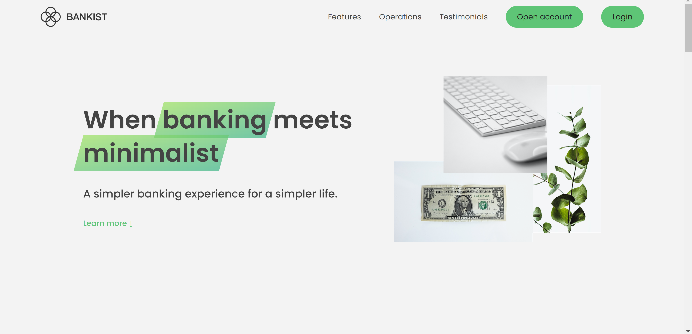
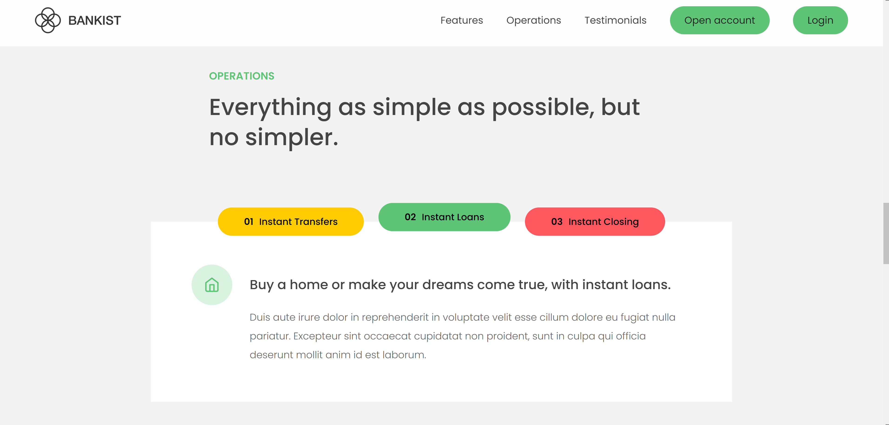
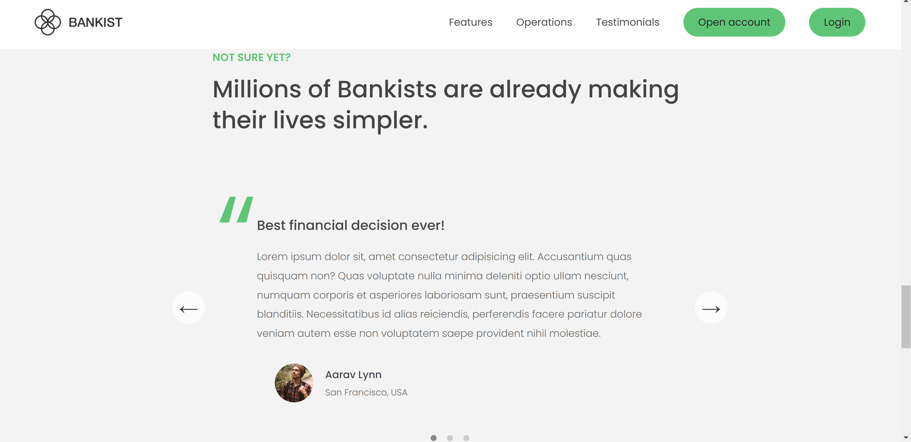
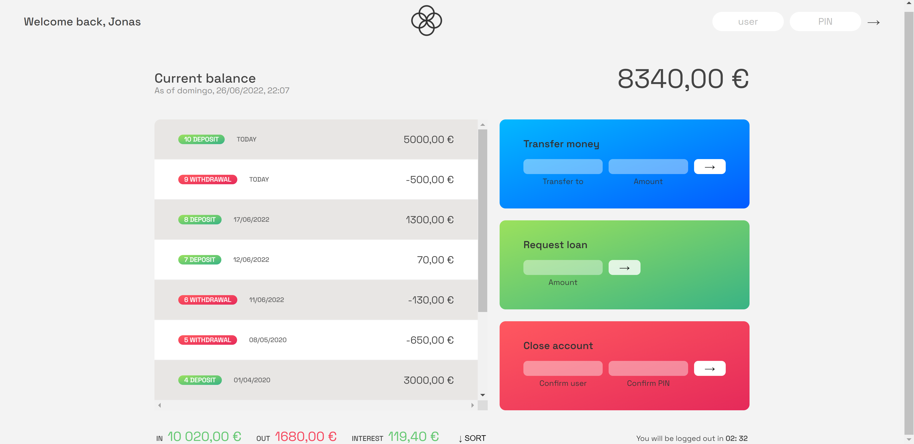

# Bankist-App

## Link:

Check it out here: https://mully7773.github.io/Bankist-App/

## Description

This is a mock-bank application I built with the help of Jonas Schmedtmann's JavaScript course. All rights belong to Jonas Schmedtmann. This project helped strengthen my DOM manipulation and vanilla JavaScript skills. For the sake of learning and reviewing, I've left many comments throughout the code.

 

## Screenshots

## Functionality

The application features a seamless homepage UI that provides users with information about the banking functions and capabilities. The homepage utilizes many unique features such as smooth scrolling, lazy loaded images, hover and scroll effects, and more using vanilla JavaScript and the built-in Intersection Observer API. The code has been refactored for performance optimization, efficiency, and readabilty.
 

After a user logs in, they can transfer funds, requests loans, or close their account. Requesting loans takes three seconds to simulate taking time to receive a loan in the real world. The user's current balance, interest accumulation, and most recent transactions are displayed along with the date. Dates and currencies are updated and displayed using the built-in Intl API, so users from different countries can see their funds and dates in a more native setting. Finally, a logout timer successfully logs out a user if they are inactive for three full minutes. This feature was implemented to simulate the security logout function many modern websites include.
 
 

## Login Information

Feel free to log in using any of the following credentials. Users may transfer money to other accounts using other usernames and transfer amounts in the transfer money box. The money transferred to that account is reflected instantly. Users can also close their account in the close account box by using the same credentials they used to log in.

Jonas (Euros)
 
user: js
 
pin: 1111

Jessica (Yen)
 
user: jd
 
pin: 2222

Steven (U.S. Dollar)
 
user: stw
 
pin: 3333
 
 

## Questions:

Feel free to contact me at mully7773@gmail.com if you have any questions.  
You can view more of my projects at https://github.com/Mully7773.
